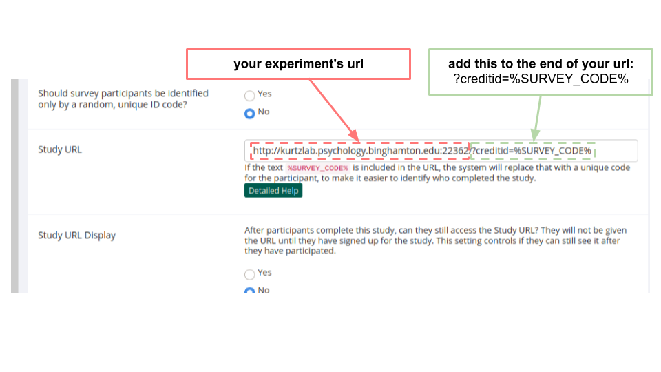

# Webrunner Manual (v1.0)


# Installation & Setup
### Step 1: Setup your Server

- OS should be Linux (should also work on macOS)

  - i haven't tested this on windows

- Download python 3 and all the dependencies (see `_/requirements.txt` file)

- Open up a port to send traffic through (see Ports)

  > ^ you'll likely need to contact your IT dept for this; or [do it yourself](https://www.computerhope.com/issues/ch001201.htm) if you have control of the router

- If running from your university/organization, contact your IT dept to serve a domain name for your server

- Set up your sql server (see SQL)

  - the webrunner repo is currently set up to just use sqlite; if you want to roll the dice with sqlite, you don't have to worry about this step

    > i've found that sqlite has worked pretty much flawlessly to handle the amount of traffic we typically get using SONA; if you're running heavier traffic you'll want to switch to something like mySQL

- it also helps to have a program that lets you run things in the background is also really useful (i suggest [screens](https://en.wikipedia.org/wiki/GNU_Screen)) 

> You'll also want to familiarize yourself with the unix terminal


### Step 2: Setup the Webrunner Repo

- Download [the main repo]() from github
- Edit the `config.py` file (see Config File)
- add your own experiments (see Adding Experiments)
  - and delete all the examples

> you'll also want to familiarize yourself with the webrunner repo organization (see Repo Organization)


### Step 3: Execute Webrunner

- execute the `run.py` file
- point potential subjects to the server address (url)

- compensate subjects when they're finished
  - the webrunner is currently set up to automatically assign credit via SONA (see SONA Credit Assignment)
    - it doesn't always work so be sure to monitor things as they progress; expect emails from subjects if the credit assigner stops working


---

# Running the Webrunner
## Basic Operations

To run the webrunner, execute the `run.py` file. For example, you can likely just type this into the terminal:

```bash
python run.py
```

That's really all you have to do once you've gone through all the work involved in setting things up (see _the rest of this manual_).


## The Config.py File

This is probably the most important part of the setup; you'll have to heavily edit/review the config file to fit your particular circumstance. Here's the list of variables (w/ explanations) in the `config.py` file:

**host:** [string] this should be a string that corresponds to the url you want to send traffic to. I think you can just leave this as `0.0.0.0`

**port:** [integer] this is the port number that your computer sends traffic through. your computer has many ports; websites are usually hosted on port 80. More info can be [found here](https://en.wikipedia.org/wiki/Port_(computer_networking)).

**SECRET_KEY:** [string] this should be a random string. Flask uses this key to keep track of user session data. if an unauthorized person found this key, they could get access to session data. 

- tl;dr: keep the secret key safe from unauthorized people

**path_to_participants_db:** [string] this is the path to the sql database; if you're using sqlite, you can ignore this particular line

**security:** [string] this should be a string that's either `"anonymous"` or `"confidential"`. If `anonymous`, you'll have no particular way to link subjects' real names to their data. If `confidential`, there _will_ be a link between subjects' names and their data. It is set to `anonymous` by default.

**show_exit_survey:** [boolean] if this is set to `True`, it will show a few exit survey questions after the debriefing form. You can edit the question in the `app/forms.py` file.

**SONA:** [boolean] if set to `True`, this will try and automatically assign credit to users coming from SONA. to get this working, you'll have to add this option to your SONA experiment page (see SONA Credit Assignment).

**SONA_link:** if using SONA, this is the link you send subjects to that will trigger SONA to give them credit. In your experiment page on SONA, they'll provide a few links titled **Completion URLs**. Add the `(client-side)` link to this line in the config file (and remove the `XXXX` at the end).

**experiments:** [dictionary] this one is _very_ important. the webrunner is set up to run a subject through multiple experiments in the same session. each experiment _must_ have an entry in the `config.experiments` dictionary. See Adding New Experiments for more info

**active:** [list] this is a list with the experiment names you want to run. the name _must_ match the entry in the `config.experiments` dictionary. These will be run in a random order.

- ^ the order of experiments will be randomized. If you need a set of experiments to  have a specific order, just make that set of experiments a _list_ <-- the order of the list will be preserved. For example, your `active` variable would look something like this:

  ```python3
  active = [
  	'exp1', 
  	'exp2',
  	['exp3', 'exp4'] # <-- exp4 always follows exp3
  ]
  ```

  

While that seems like a lot, you don't really have to do any of this from scratch; just tweak the existing `config.py` file to your particular needs


### The Consent and Debriefing Forms

To get your experiment IRB approved, you'll obviously need to have consent and debriefing forms. The webrunner will automatically display whatever text is in the `app/templates/consentform.html` and `app/templates/debriefform.html` files.

- ^ so basically just copy/paste your consent forms into those

  > text -> html converters are your friend


## SONA Credit Assignment
When setting up your experiment on SONA, there will be an option to include a `%SURVEY_CODE%` tag in your study's url. SONA will automatically fill this in with a `credit id number` that will let you automatically sign credit (eventually) once the subject has finished. The webrunner assumes that the **%SURVEY_CODE%** will be inserted as a url parameter labelled `creditid`

- ^ if `config.SONA` is set to `True`, the webrunner will try and automatically assign credit to the creditid number. 


Here's an example of what that looks like ( you'll obviously have to replace our experiments url with your experiment's url):



Here's [some info](https://support.google.com/google-ads/answer/6277564?hl=en) on how url parameter's work

dig around [here](https://www.sona-systems.com/help/) for more info on automatic credit assignment with SONA


## Deployment Servers (waitress)

I use [waitress](https://docs.pylonsproject.org/projects/waitress/en/stable/) to deploy the flask server. Flask has it's own built in one, but it's not super ideal for legit deployment scenarios. See this [doc page](https://flask.palletsprojects.com/en/1.1.x/tutorial/deploy/) for more info.


## HTTPS(ecure)

coming eventually...

(I don't know how to do this, but it seems important)


## Tips
- use **text -> html converters** to save time when making html text pages (like the consent form and debriefing form)
    - there are a bunch of free ones online; they're pretty convenient 
- **sql database** viewers are very helpful if you want to view things like the participant ids, subject names, experiment condition assignment, etc.
    - [DB Browser for SQLite](https://sqlitebrowser.org/) works really well
    - I've also enjoyed using [Beekeeper Studio](https://www.beekeeperstudio.io/)
- **errors & debugging**: when things go wrong with the webrunner, you'll likely see error messages printed to your OS terminal where the `run.py` file was executed. when things go wrong with a particular experiment, error messages will be printed to your browsers developer console (look up how to access your browsers console)
---


# Experiments

## Adding New Experiments

**NOTE**: To add a new experiment, you have to follow a somewhat particular format, being very mindful of the general organization. Specifically:

- all HTML templates need to be stored in: `app/templates/experiments`
- all static code needs to be stored in: `app/static/expeirments/<exp_name>`

^ If you deviate from that, there are likely going to be errors


### Step 1:  Add experiment to config.py

You'll notice the `config.py` file in the head directory. In the config file is a dictionary variable called `experiments`. Each experiment you're running needs to have an entry in this dictionary, in the following format:

```python3
experiments = {
    'experiment_name': {
        'template': 'experiment_name.html', # <-- must be unique
        'data': 'experiment_name', # <-- folder name for storage
        'conditions': ['one','two'],
    }
}
```

- The **template** key is the filename of the main html file that your experiment _starts with_. I'd suggest only using 1 template
- The **data** key is the folder where you want the data stored (i'd just make it the experiment name); your experiment's data folder will be created in the `data/` folder
- The **condition** key should point to a list with the condition names of your experiment. The webrunner will automatically cycle through this list for condition assignment. It can/should be integers or strings


### Step 2: Add html file(s) to `app/templates/experiments`

Your experiment _must_ start from it's own unique html file, and _must_ be stored in the `app/templates/experiments` folder. In your base html file, you have to import the utils script, which contains the all-important `next` function (see Building Experiments). You can do that by adding this line to the head of your html document:

```html
<script src="static/utils.js"></script>
```


### Step 3: Add static files to `app/static/experiments/<exp_name>`

All javascript & css files, images, sounds, etc must be stored in the `app/static` folder. To avoid any conflicts with other experiments, make a folder labeled as your experiment name (see examples in base repo).


## Building Experiments

You can pretty much use whatever tools you want to build experiments. There is only 1 rule you have to follow if you want the webrunner to work properly: use the `next(...)` function <-- it'll get created when you import `app/static/utils.js`

The `next` function takes 3 arguments:

- subject ID
- subject condition
- experiment results

You'll have to provide the **experiment results** variable. The other two (subject id and condition) can be automatically accessed using `'{current_user.id}'` and `'{current_user.condition}'`. For example, you're experiment should end with the following command:

```javascript
next('{{ current_user.id }}', '{{ current_user.condition }}', variable_with_your_subjects_experiment_data)
```

^ That function will save your data as a `.json` file, and load the next experiment (or take the subject to the quit page if that was the last experiment)


**Note**: don't create a function called `next`, or it will override the important one that the webrunner needs to interact with. Everything will break i think


## Tips

Here are some good tools for building psych experiments:

- the [experiment factory](https://expfactory.github.io/) by [Vanessa Sochat](https://vsoch.github.io/)
- psiturk's [experiment exchange](http://psiturk.org/ee/)
- [jsPsych](https://www.jspsych.org/) by [Josh de Leeuw](https://www.vassar.edu/faculty/jdeleeuw/)
- psychopy's [online toolkit](https://www.psychopy.org/#online) by [Jonathan Peirce](https://www.nottingham.ac.uk/psychology/people/jonathan.peirce)
- [ocanvas](http://ocanvas.org/) <-- this one wasn't designed for experiments; it's just a library that handles object manipulation in an html canvas

> there are more out there
---


# Misc

## Folder Organization
coming eventually...

## OS Configuration

coming eventually...

(basically, just use linux)

---
